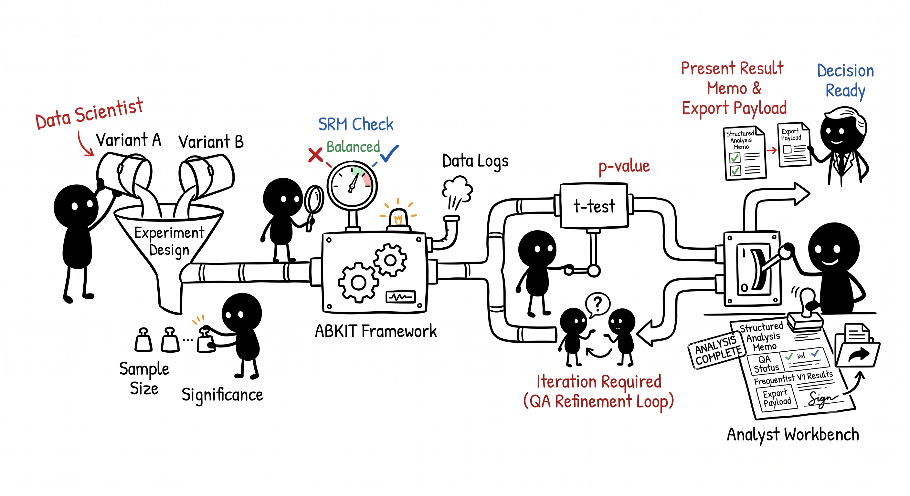

# A/B Testing Productivity Kit (abkit)

A lightweight, modular toolkit for designing, validating, analyzing, and
communicating online experiments. It is built for researchers, data scientists, and analysts who want a structured, auditable workflow for treatment-versus-control studies without needing a full experimentation platform

---

## What it is



abkit accelerates the highest-friction steps around trustworthy
experimentation:

- **Experiment spec validation** — enforce a clear, versioned config
  before a test goes live.
- **Assignment and data QA** — detect Sample Ratio Mismatch (SRM),
  duplicate assignments, metric join gaps, and other data-integrity issues.
- **Variance reduction** — assess CUPED readiness and optionally apply an
  OLS CUPED adjustment to reduce noise.
- **Analysis** — compute Welch two-sample t-tests for continuous metrics and two-proportion z-tests for binary metrics, with confidence intervals, direction-aware guardrail blocking, optional Bonferroni correction for secondary metrics, and a ship/hold/rerun/inconclusive decision.
- **Result payloads** — produce a single canonical JSON artifact that can
  drive a memo, a template, or an agent workflow.

---

## What it is not

- **Not a full experimentation platform.** abkit does not manage variant
  assignment, feature flags, or real-time traffic routing.  It works with
  data you have already collected.
- **Not a sequential testing or Bayesian engine.** All tests are
  two-sided frequentist; there is no optional stopping, and no posterior
  calculation.  Optional Bonferroni correction for secondary metrics is
  available via `apply_bonferroni_correction` in the experiment config.
- **Not a multi-variant analysis engine (v1).** Exactly two variants
  (control + one treatment arm) are supported.  Three or more variants
  raise an explicit error.
- **Not an automated reporting pipeline.** The Streamlit app and the
  memo/export features are for interactive analyst use, not scheduled
  batch reporting.

---

## Who it is for

abkit is useful for data scientists, data analysts and researchers running structured control-versus-treatment experiments where the data can be represented as assignment records plus outcome metrics.

#### Example use cases:

- Product and UX experiments with a control and one treatment.

- Behavioral or operational interventions, such as changing a message, workflow, or incentive.

- Internal research studies where pre-period behavior can support CUPED-style variance reduction.

- Reproducible analysis workflows where a canonical machine-readable result artifact is valuable for downstream review or agent-assisted summarization.

---

## How the pieces fit together

```
User / Agent
   │
   ├── abkit-app       (Streamlit workbench — interactive analyst UI)
   ├── abkit-templates (YAML/JSON schema templates and config examples)
   └── abkit-skills    (Agent-facing skills: spec-review, prelaunch-qa, results-memo)
             │
             ▼
        abkit-core      (All business logic, schemas, statistics)
```

**`abkit-core`** is the only place where validation logic, statistical
tests, and schema definitions live.  It has no Streamlit imports and no
I/O beyond accepting DataFrames.

**`abkit-app`** is a thin Streamlit workbench.  It collects file uploads,
calls `abkit-core`, and renders the results.  No formulas or significance
checks are re-implemented in the UI.

**`abkit-templates`** contains versioned JSON schemas for experiment
configs and result payloads, YAML config templates and copy-paste
examples, and CSV templates for the assignment and metrics upload inputs.

Data flows in one direction: config → QA → analysis → result payload →
memo/export.  Session state in the app enforces this order and invalidates
downstream outputs whenever upstream inputs change.

---

## Repository layout

```text
.
├── README.md
├── LOCAL_RUN.md              ← step-by-step walkthrough with fixture scenarios
├── abkit-core/
│   ├── pyproject.toml
│   ├── src/abkit_core/
│   │   ├── __init__.py       ← public API surface
│   │   ├── schemas.py        ← Pydantic schemas shared across all layers
│   │   ├── design.py         ← experiment spec validation
│   │   ├── quality.py        ← SRM, assignment QA, metric QA, join integrity
│   │   ├── variance.py       ← CUPED readiness assessment and OLS adjustment
│   │   └── analysis.py       ← statistical analysis and decision scaffolding
│   └── tests/
│       ├── fixtures/         ← clean, srm, weak_cuped, guardrail_ship, bonferroni_on, bonferroni_off scenarios
│       ├── test_schemas.py
│       ├── test_design.py
│       ├── test_quality.py
│       ├── test_variance.py
│       └── test_analysis.py
├── abkit-app/
│   ├── pyproject.toml
│   ├── app.py                ← Streamlit entry point
│   ├── pages/
│   │   ├── 1_Setup.py        ← config upload, spec validation, duration plan
│   │   ├── 2_QA.py           ← assignment + metric QA, SRM, CUPED readiness
│   │   ├── 3_Analysis.py     ← raw vs CUPED estimates, decision
│   │   └── 4_Memo.py         ← readable summary, JSON/text export
│   └── components/
│       ├── issue_display.py  ← shared DiagnosticIssue renderer
│       └── metric_table.py   ← shared MetricEstimate renderer
├── abkit-skills/
│   ├── shared/
│   │   ├── agent-setup.md        ← how to use skills in Claude, Codex, IBM Bob
│   │   └── consuming-results.md  ← full ResultPayload field reference for skills
│   ├── spec-review/README.md     ← pre-launch experiment spec review prompt
│   ├── prelaunch-qa/README.md    ← QA results interpretation prompt
│   └── results-memo/README.md    ← analysis review + decision memo drafting prompts
└── abkit-templates/
    ├── configs/
    │   ├── experiment_config.schema.json          ← machine-generated
    │   ├── result_payload.schema.json             ← machine-generated
    │   ├── experiment_config.template.yaml        ← full annotated config template
    │   ├── example_guardrail_directions.yaml      ← direction-aware guardrail example
    │   ├── example_bonferroni_off.yaml            ← Bonferroni OFF example
    │   ├── example_bonferroni_on.yaml             ← Bonferroni ON example
    │   └── README.md                              ← config template guide
    └── data/
        ├── assignments_template.csv               ← minimal assignments CSV template
        ├── metrics_template.csv                   ← minimal metrics CSV template
        └── README.md                              ← CSV column reference
```

---

## Running the tests

Tests live in `abkit-core/tests/` and use pytest.

```bash
# Install core with dev dependencies
pip install -e "abkit-core[dev]"

# Run the full test suite
cd abkit-core
pytest

# Run with coverage
pytest --cov=abkit_core --cov-report=term-missing
```

There are five test modules covering schemas, design validation, QA
checks, CUPED variance reduction, and end-to-end analysis.  Six fixture
scenarios are provided (`clean`, `srm`, `weak_cuped`, `guardrail_ship`,
`bonferroni_on`, `bonferroni_off`) to drive the main code paths.

---

## Regenerating the schema artifacts

Both `abkit-templates/configs/experiment_config.schema.json` and
`abkit-templates/configs/result_payload.schema.json` are machine-generated
from the live Pydantic models in `abkit-core`.  They are **not** maintained
by hand.  After any change to a model in
`abkit-core/src/abkit_core/schemas.py`, regenerate both with:

```bash
# From the repo root
cd abkit-core
python3 -c "
import json, sys
sys.path.insert(0, 'src')
from abkit_core.schemas import ExperimentConfig, ResultPayload

ec = ExperimentConfig.model_json_schema()
ec['description'] = 'Schema version 1.2 — canonical experiment configuration for abkit. Generated from abkit_core.schemas.ExperimentConfig.'
with open('../abkit-templates/configs/experiment_config.schema.json', 'w') as f:
    json.dump(ec, f, indent=2); f.write('\n')

rp = ResultPayload.model_json_schema()
rp['description'] = 'Schema version 1.2 — canonical result payload for abkit. Generated from abkit_core.schemas.ResultPayload.'
with open('../abkit-templates/configs/result_payload.schema.json', 'w') as f:
    json.dump(rp, f, indent=2); f.write('\n')

print('Both schema artifacts regenerated.')
"
```

The output is standard JSON Schema. The `$defs` block holds every
sub-schema referenced by the root models, including `AnalysisResult`,
`DecisionMemo`, `MetricEstimate`, and all nested types.

---

## Running the Streamlit app

```bash
# 1. Install abkit-core (required dependency)
pip install -e abkit-core

# 2. Install the app and its dependencies
pip install -e abkit-app
# or manually:
pip install streamlit pyyaml pandas

# 3. Launch
streamlit run abkit-app/app.py
```

The app opens at `http://localhost:8501` by default.

Walk through the four pages in order:

| Page | What it does |
|---|---|
| **1 · SETUP** | Upload config YAML, validate spec, view duration estimate |
| **2 · QA** | Upload assignment and metric CSVs, run SRM + CUPED checks |
| **3 · ANALYSIS** | Run statistical analysis, compare raw vs CUPED estimates |
| **4 · MEMO** | Read the decision summary, export result payload as JSON |

Use the fixture files in `abkit-core/tests/fixtures/` as sample inputs.
See [`LOCAL_RUN.md`](LOCAL_RUN.md) for a detailed end-to-end walkthrough
with expected outputs for all six fixture scenarios.

---

## Design principles

- Shared schemas come first.  All layers use the same Pydantic models.
  Schema drift is treated as a bug.
- Business logic belongs in `abkit-core`, not in the UI or templates.
- The Streamlit app is a workbench, not a monolithic platform.
- Each feature must be testable with small, deterministic fixtures.
- Structured outputs (`ResultPayload`) are the contract between the
  Python core and all downstream consumers.

---

## Intentionally deferred in the current tool version

The following are known simplifications that are documented but not
addressed in this release:

- **Multi-variant analysis.** Only two-variant (A/B) experiments are
  supported.  `run_analysis` raises `ValueError` for configs with more
  than two variants.
- **Sequential and Bayesian testing.** All tests are fixed-horizon
  two-sided frequentist.
- **Multiple-comparison correction.** Secondary metrics support optional
  Bonferroni correction via `apply_bonferroni_correction: true` in the
  experiment config.  When enabled with m ≥ 2 secondary metrics, each is
  tested at `alpha / m` instead of `alpha`.  The primary metric and guardrail
  metrics are always tested at the declared `alpha`.  Correction is off by
  default (`apply_bonferroni_correction: false`).
- **Segment analysis.** The `segments` field in `ExperimentConfig` is
  parsed and validated but no per-segment breakdowns are computed.
- **Duration planner accuracy.** The planner on the Setup page uses a
  simplified variance model (fixed base rate of 0.1 for proportion
  metrics; unit variance for continuous).  It is for planning orientation
  only and is not used as a stopping rule.
- **Persistent storage.** All state is held in Streamlit session state
  scoped to the browser tab.  Refreshing the page clears all uploaded
  data.

See [`LOCAL_RUN.md`](LOCAL_RUN.md) for additional UX rough edges that are
intentionally deferred.

---

## About the Authors

**Vaisakhi Mishra** — AI Engineer - Data Scientist

- LinkedIn: [(https://www.linkedin.com/in/vaisakhi-mishra/](https://www.linkedin.com/in/vaisakhi-mishra/)

**Jagannathan Ramanujam** — Software Engineer - DevOps

- LinkedIn: [https://www.linkedin.com/in/rjagannathan23/](https://www.linkedin.com/in/rjagannathan23/)

---

## License

MIT License. See [LICENSE](LICENSE).
